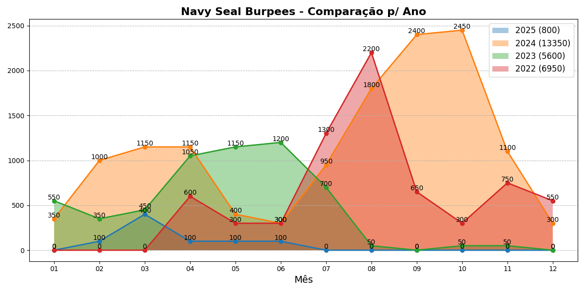

# Navy Seal Burpees Tracker



O **Navy Seal Burpee** é o número #1 dos exercícios. É uma variação avançada e intensa do burpee tradicional que inclui três flexões e "mountain climbers" dentro de cada repetição, tornando-o um exercício completo que envolve todos os grupos musculares principais, especialmente peito, braços, ombros, core e pernas. Ele também aumenta a frequência cardíaca rapidamente, proporcionando um treino cardiovascular eficaz. Esse exercício é excelente para melhorar força, resistência, coordenação, agilidade e letalidade. Contar cada repetição torna-o um exercício de corpo e mente.

The **Navy Seal Burpee** is the number #1 exercise. It is an advanced and intense variation of the traditional burpee that includes three push-ups and mountain climbers within each repetition, making it a complete exercise that engages all major muscle groups, especially the chest, arms, shoulders, core and legs. It also quickly increases the heart rate, providing an effective cardiovascular workout. This exercise is excellent for improving strength, endurance, coordination, agility and lethality. Counting each repetition makes it a mind-body workout.

## Visão Geral

O **Navy Seal Burpees Tracker** é uma aplicação para monitorar e registrar a quantidade de Navy Seal Burpees (NSBs) realizados. O sistema é baseado em notebooks Jupyter e utiliza arquivos CSV para armazenar e gerenciar os dados.

Os arquivos principais incluem:

**NSB (ano).ipynb**:

Notebooks Jupyter para inserção dos dados diários. Estes notebooks permitem a inserção de dados de NSBs para cada dia do mês e fornecem gráficos mensais. Eles geram os arquivos CSV com os totais de NSBs para cada mês do ano.

**Navy Seal Burpees.ipynb**:

Notebook principal que processa os dados dos arquivos CSV gerados e mantém análises comparativas anuais. Ele acessa os arquivos CSV armazenados na pasta `backup` para gerar gráficos e relatórios sobre o desempenho anual.

## Requisitos

- Python 3.x
- Bibliotecas: `pandas`, `matplotlib`, `calendar`, `IPython`, `os`, `shutil`

    ```bash
    pip install pandas matplotlib IPython
   ```
  
## Configuração

1. **Clone o Repositório**

   Clone este repositório para o seu ambiente local usando:

   ```bash
   git clone https://github.com/Santana-DS/Navy-Seal-Burpees
   ```
   
## Uso
**Para abrir o notebook Jupyter**

   ```bash
   python -m notebook
   ```

**Inserção e Visualização dos Dados**

Para adicionar dados e visualizar gráficos mensais, abra o notebook correspondente ao ano desejado NSB (ano).ipynb.
Execute as células do notebook para inserir os dados diários e gerar gráficos.

**Processamento e Análise dos Dados**

Abra o notebook Navy Seal Burpees.ipynb.
Este notebook processa os dados dos arquivos CSV armazenados na pasta backup e gera análises comparativas anuais.

**Atualização e Backup**

Os dados são salvos e atualizados automaticamente pelos notebooks de inserção. Os caminhos para os arquivos CSV são especificados por caminhos relativos com base no diretório atual
